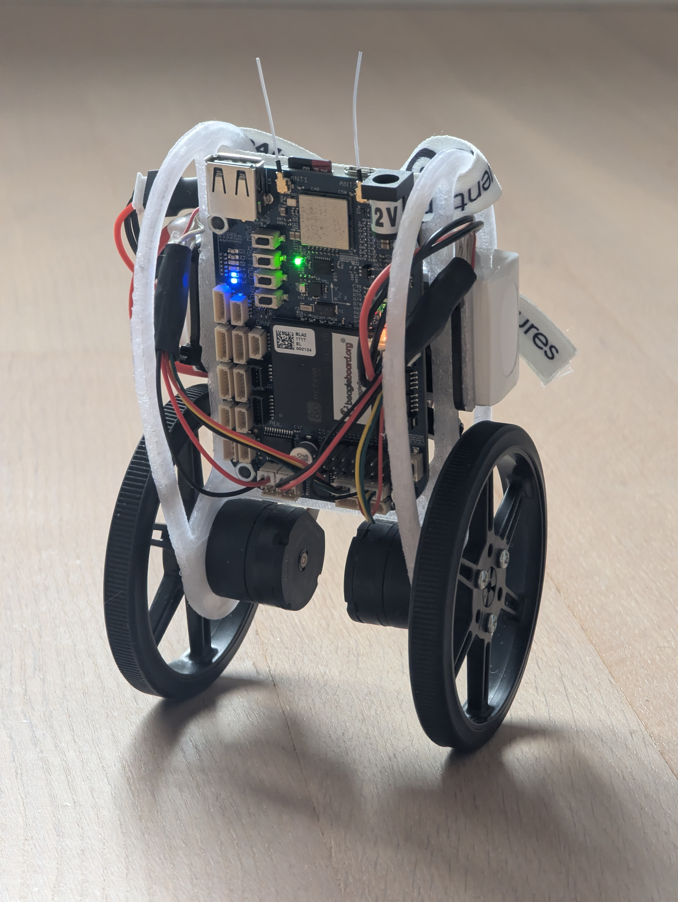
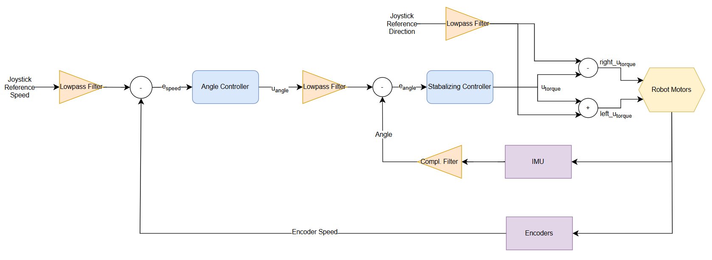

# Self-Balancing-Robot
A balancing two wheeled robot which can be steered over a bluetooth controller. The controllboard used is a **BeagleBone Blue** (image: https://www.beagleboard.org/distros/am3358-debian-10-3-2020-04-06-4gb-sd-iot).

<div style="text-align: center;">
  
</div>

### Cascaded Control Loop
The cascaded control loop consists of:
1. Inner loop (angle control): Stabilizes the tilt using IMU feedback.
2. Outer loop (velocity control): Maintains position or moves at the desired speed.
<div style="text-align: center;">
  
</div>

### To start the main script (pid_cntr.py) over a phisical button on the BBB board

save the file 'button_luncher.py' as follows on BBB
```bash
sudo nano /usr/local/bin/button_launcher.py
chmod +x /usr/local/bin/button_launcher.py
```

Autostart the 'button_luncher.py' by enabling 'button-launch.service'
```
sudo nano /etc/systemd/system/button-launch.service
sudo systemctl enable button-launch.service
sudo systemctl start button-launch.service
```